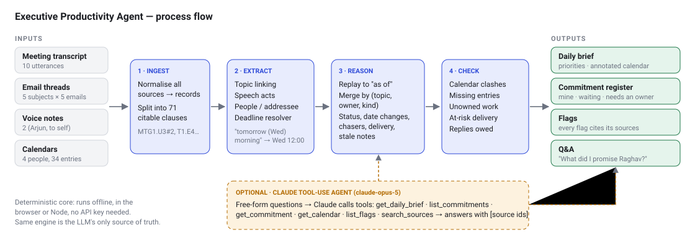

# Executive Productivity Agent

**Assignment 1 — Agentic AI Factory | AIONOS**

An agent that reads Arjun Malhotra's messy week (a meeting transcript, four calendars, 25 emails in 5 threads, and 2 voice notes) and turns it into a **daily action brief**. It keeps a **de-duplicated commitment register**, flags **unclear ownership** without guessing an owner, and **answers questions** such as *"What did I promise Raghav?"* or *"What needs action today?"*. Every claim links back to the source it came from.



---

## Run it (one command)

```bash
npm start
```

Then open **http://localhost:3000**. The core agent needs only Node.js 18 or later. It has **no dependencies**, so you don't need to run `npm install` first.

Other ways to run it:

| What | Command |
|---|---|
| Open without a server | Double-click `index.html`. The whole agent runs in the browser. |
| Daily brief in the terminal | `npm run brief -- --as-of 2026-09-24T08:30` |
| Ask a question in the terminal | `npm run ask -- "What did I promise Raghav?" --as-of 2026-09-24T08:30` |
| Commitment register | `node cli/epa.js register --as-of 2026-09-25T09:00` |
| Export everything as JSON | `node cli/epa.js export output.json` |
| Acceptance tests | `npm test` (13 tests, one per requirement) |

### Optional: Claude mode (free-form questions)
```bash
npm install                      # installs @anthropic-ai/sdk
set ANTHROPIC_API_KEY=sk-ant-... # PowerShell: $env:ANTHROPIC_API_KEY="sk-ant-..."
npm start
```
With a key set, the chat panel shows a **Use Claude** toggle. Claude (`claude-opus-5`) gets **tools** over the same engine (brief, commitments, calendar, flags, source search). It has to call those tools and cite source ids in its answer, so it can't make up owners or dates. Without a key, the offline agent answers instead. CLI: `node cli/epa.js ask "..." --claude`.

### Hosted demo (GitHub Pages)
The UI is static, so GitHub Pages can serve it as is. Go to *Settings → Pages → Deploy from branch → `main` / root*. The hosted version runs the offline agent. Claude mode needs `npm start` with a key.

---

## What the brief requires, and where it's handled

| The agent should… | How | Where to see it |
|---|---|---|
| Identify commitments made by the executive | Speech-act rules (`I'll`, `I'd`, `I owe`, `need to`, `can you…` → owner) on every clause of the meeting, email and voice notes | *Commitments* tab → "My actions" |
| Separate "my actions" from "waiting on others" | `owner === Arjun` → mine. Another named owner → waiting. No owner → **needs an owner** | Brief: three columns |
| Detect deadlines and overdue items | Temporal resolver handles phrases like "end of day tomorrow", "tomorrow (Wednesday) morning", "before Thursday's board prep", and "Wednesday evening, not Thursday". It counts down from the chosen **as-of** moment | Status badges, *Do first* |
| Deduplicate the same action across sources | One commitment per (topic, owner, kind). Topics are linked by thread subject, keyword overlap, and coreference. For example, the vendor list merges **7 sources** into one item | Click any item to see its merged evidence timeline |
| Flag unclear ownership rather than inventing it | Ownership doubts and disclaimers create an **UNOWNED** item. It lists who disclaimed it and who was suggested, and the agent never assigns an owner | *Needs an owner*, *Flags* |
| Produce a daily brief | Ranked priorities, today's calendar with notes (clashes, prep, un-booked meetings), my actions, waiting on, unowned, closed | *Daily brief* tab / `npm run brief` |
| Answer questions | Offline intent router, or the Claude tool-use agent | Chat panel / `npm run ask` |

**Beyond the brief**, the agent also:
- Finds the **9:30 AM Thursday deck review** that clashes with *Board Prep Session* and isn't on Arjun's calendar.
- Spots Divya's "Quick Call with Arjun", which is missing from Arjun's calendar.
- Catches that Divya's first email target ("Thursday morning") was **after** the board prep where the report was needed.
- Recognises that the Wed voice note "I owe Priya a time" is **stale**, because Priya had already confirmed on Tuesday.
- Tracks **replies Arjun owes** and how many times a date has **changed**.

## Time travel
The data covers **Mon 21 to Fri 25 Sep 2026**. Pick any day and time at the top of the page. The agent **replays only what had happened by then**, so on Monday afternoon it doesn't know Divya will deliver on Wednesday. Every deadline counts down from the moment you pick.

## Project layout
```
data/sources.js         the data pack, transcribed verbatim (the only input)
src/engine/             the agent (plain JS, runs in both browser and Node)
  ingest.js             records → citable clauses
  temporal.js           fuzzy deadline language → timestamps
  extract.js            topic linking, speech acts, people, deadlines
  reason.js             replay → de-duplicated commitment register + status
  calendar.js           cross-calendar conflict / missing-entry detection
  brief.js              flags + daily brief
  qa.js                 offline question answering
  agent.js              pipeline facade (run(asOf))
src/llm/claude-agent.js optional Claude tool-use agent
server.js               static server + /api/ask
cli/epa.js              command-line interface
web/                    UI
test/agent.test.js      acceptance tests
docs/                   architecture, inputs & assumptions, AI tools, demo script
presentation/           10-slide deck
```

## Documentation
- [Architecture and process flow](docs/ARCHITECTURE.md)
- [Inputs, sources and assumptions](docs/INPUTS_AND_ASSUMPTIONS.md)
- [AI tools used and how](docs/AI_TOOLS_USED.md)
- [15-minute demo and defence script](docs/DEMO_SCRIPT.md)
- [10-slide deck](presentation/Executive_Productivity_Agent.pptx)
