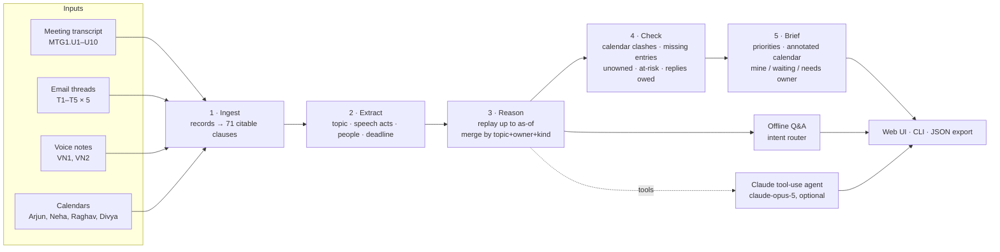

# Architecture and process flow

## Design in one paragraph
The agent has a **deterministic, auditable core** that runs anywhere: in the browser, in Node, and without an API key. It turns raw sources into a de-duplicated **commitment register** and a **daily brief**. An **optional Claude layer** handles free-form questions. It does this only by calling tools over that same core. The core is the only source of truth, and every output carries source ids. This is why the agent can promise not to invent owners or dates.

## Process flow

## Stages

| # | Stage | File | What it does | Example from the data |
|---|---|---|---|---|
| 1 | Ingest | `src/engine/ingest.js` | Normalises the 4 source types into `records`. Splits each one at sentence and em-dash boundaries into `clauses`, and gives each clause a stable id. | `T1.E4` → "Sorry, got pulled into board prep" / "will send by tomorrow (Wednesday) morning for sure." |
| 2a | Topic linking | `src/engine/extract.js` | Email: the thread subject. Meeting/voice: keyword overlap with topic signatures (subject words, plus external orgs and people in the thread). If nothing matches, the clause **inherits the previous clause's topic** (coreference). | "I think that's supposed to be Facilities…" has no keywords, so it inherits *Mumbai Office Lease Renewal* from Raghav's previous line. "Also Meridian call" matches *Call Reschedule* through the org alias. |
| 2b | Speech acts | `extract.js` | A transparent lexicon: COMMIT, REQUEST, ACCEPT, PROPOSE, REVISE, DELIVER, ACK, FOLLOWUP, OWNERSHIP_UNCLEAR, DISCLAIM, SUGGEST, NOTICE, REVIEW_INTENT, PROGRESS | "Report attached, sent as promised." → DELIVER |
| 2c | Deadlines | `src/engine/temporal.js` | Resolves fuzzy phrases relative to when they were said. Drops negations ("not Thursday", "instead of Wednesday"), availability ranges and glosses. Resolves event anchors ("before board prep") against Arjun's calendar. An explicit clock time beats other mentions; otherwise the **last** mention wins. | "I said Wednesday, but realistically Thursday morning is safer" → Thu 12:00 |
| 3 | Reason | `src/engine/reason.js` | Replays clauses in time order up to **as-of**. Folds them into commitments keyed by **(topic, owner, kind)**: the *de-duplication key*. It sets owner and beneficiary (request → the addressee owns it; commit → the speaker owns it) and records the deadline history with the type of each entry (promised / requested / agreed / revised / self-note). It then works out status, the number of date changes, chasers, delivery, stale restatements and pending replies. | Vendor list: 7 sources, 1 commitment |
| 4 | Check | `src/engine/calendar.js` + `brief.js` | Checks times agreed in email against Arjun's calendar, and other people's entries that name Arjun against Arjun's calendar. It also flags unowned work, deliveries due after they're needed, stale reminders, date drift, and replies owed. | Deck review 9:30 vs Board Prep 9:00–10:00 |
| 5 | Brief & Q&A | `brief.js`, `qa.js` | Ranks priorities (overdue > unowned-near-deadline > clash today > due today > decisions/replies > at-risk). Adds notes to today's calendar. Answers questions. | "Do first: 1. Send Raghav the updated vendor list — was due Wed 12 PM…" |

## Key decisions (and why)

1. **The de-duplication key is (topic, owner, kind), not text similarity.** The same promise is phrased very differently across sources ("I'd send him the updated vendor list" / "will send first thing tomorrow" / "need to get Raghav that vendor list"). What stays the same is *what* it's about, *who* has to do it, and *what kind* of action it is.
2. **Ownership comes only from speech acts.** A request makes the addressee the owner, and a commitment makes the speaker the owner. A *suggestion* ("supposed to be Facilities") is recorded as an unconfirmed **candidate** and never becomes the owner. Disclaimers are recorded too.
3. **Effective deadline = the latest firm statement.** Firm means promised, agreed, revised or restated. A bare *request* doesn't set the deadline unless it's the only statement. A **private voice note never relaxes** a promise already made to someone else: in VN1 Arjun says "might slip to tomorrow morning", but his email to Raghav said "first thing tomorrow morning".
4. **Time travel.** The engine replays only statements made up to *as-of*. This keeps "overdue" honest and lets the reviewer watch the week unfold.
5. **Scheduling is complete when the other side confirms the time.** Priya's "Wednesday 3 PM works, confirmed" closes Arjun's "reconfirm the new time". Arjun's later voice note "I owe Priya a time" is therefore shown as **stale** and isn't reopened.
6. **The LLM is a consumer of the engine, not its source of truth.** Claude only sees the data through tools, and the system prompt forbids inventing owners or dates. In the tool loop, the stable system prompt is cached, and the current time goes in the user turn so the cache stays valid.

## Claude tool-use agent (optional)
`src/llm/claude-agent.js` runs a manual agentic loop on `claude-opus-5` with adaptive thinking and server-side refusal fallbacks enabled. The loop goes: model → `tool_use` → the tool runs against the engine at the chosen as-of → `tool_result` → … → final answer. There are at most 8 turns. The tool calls are returned to the UI so the reviewer can see which tools the agent used.

| Tool | Purpose |
|---|---|
| `get_daily_brief` | Headline, priorities, annotated schedule |
| `list_commitments(direction, person, status)` | Filtered register |
| `get_commitment(id)` | Deadline history, merged evidence timeline, flags |
| `get_calendar(date, person)` | Events, agreed-but-unbooked times, issues |
| `list_flags` | All risk flags |
| `search_sources(query)` | Keyword search over clauses said up to as-of |

## Limits and next steps
- The rule lexicon is tuned to business English like the phrasing in this data pack. For real mail volume, the next step is to swap stage 2 for **LLM extraction into the same schema** (structured outputs). Each extracted item would still carry the verbatim quote it came from, and the grounding test (`test/agent.test.js`) checks that the quote exists.
- Connectors (Gmail/Outlook, Google/Microsoft calendar, a speech-to-text feed for voice notes) would replace `data/sources.js`. The rest of the pipeline doesn't change.
- Write actions (sending a reply, adding the deck review to the calendar) are deliberately **left out**. The agent drafts and recommends, and the executive decides.
